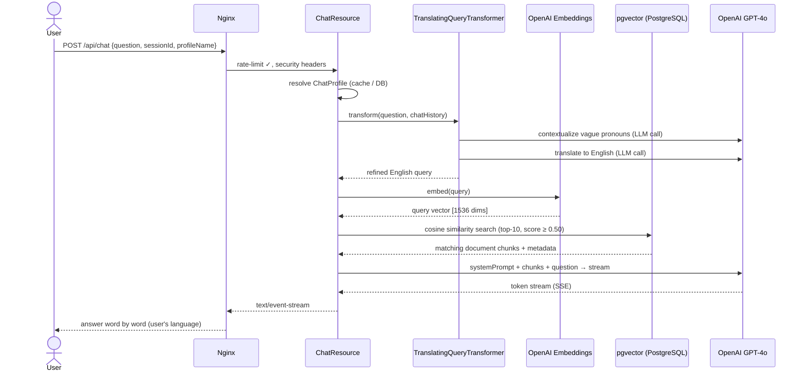
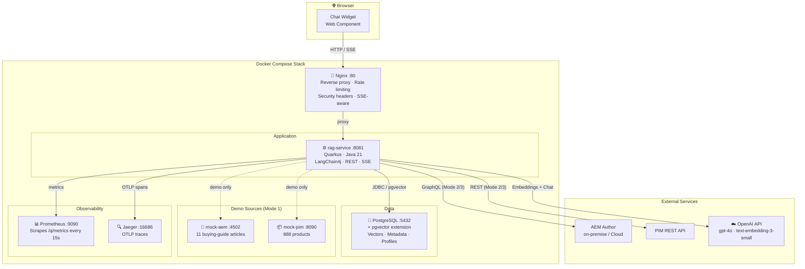
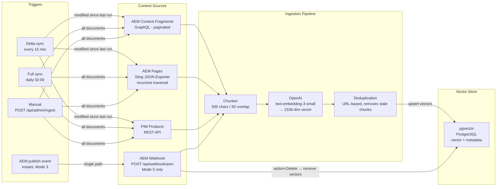

# RAG Service

A production-grade **Retrieval-Augmented Generation (RAG)** microservice for AEM content and PIM product data.
Responds in any language, streams answers token-by-token, and embeds as a one-liner Web Component on any website.

**Maintainer:** Łukasz (lukaszburmax@gmail.com)

---

## Table of Contents

- [Quick Start](#quick-start)
- [Prerequisites](#prerequisites)
- [Technology Stack](#technology-stack)
  - [Application layer](#application-layer)
  - [AI / LLM layer](#ai--llm-layer)
  - [Data layer](#data-layer)
  - [Content ingestion layer](#content-ingestion-layer)
  - [Infrastructure layer](#infrastructure-layer)
  - [Security model](#security-model)
  - [How a user question flows through the system](#how-a-user-question-flows-through-the-system)
- [How does it work?](#how-does-it-work)
- [Mode 1 — Demo (one-command start)](#mode-1--demo-one-command-start)
- [Mode 2 — Real AEM + PIM, scheduled polling](#mode-2--real-aem--pim-scheduled-polling)
- [Mode 3 — Real AEM, real-time push webhook](#mode-3--real-aem-real-time-push-webhook)
  - [Webhook request format](#webhook-request-format)
  - [Complete request examples](#complete-request-examples--all-scenarios)
  - [How webhook and scheduled sync work together](#how-webhook-and-scheduled-sync-work-together)
- [Services after startup](#services-after-startup)
- [Architecture](#architecture)
- [API Reference](#api-reference)
  - [Chat — SSE streaming](#chat--sse-streaming)
  - [Admin — Ingestion endpoints](#admin--ingestion-endpoints)
  - [Admin — Generic Push Ingestion API](#admin--generic-push-ingestion-api)
  - [Admin — Chat Profiles API](#admin--chat-profiles-api)
  - [Health & Observability](#health--observability)
- [Chat Widget — Web Component](#chat-widget--web-component)
- [Security](#security)
  - [Admin API Key](#admin-api-key)
  - [CORS](#cors)
  - [HTTPS (Nginx)](#https-nginx)
- [Local dev mode (no Docker)](#local-dev-mode-no-docker)
- [Kafka Integration (Optional)](#kafka-integration-optional)
- [Building](#building)
- [Stopping & Cleanup](#stopping--cleanup)
- [Troubleshooting](#troubleshooting)
- [Full Configuration Reference](#full-configuration-reference)
- [Current State](#current-state)
- [Chat Profiles — Business Use Case Control](#chat-profiles--business-use-case-control)
  - [Profile fields reference](#profile-fields-reference)
  - [Step-by-step: creating your first custom profile](#step-by-step-creating-your-first-custom-profile)
  - [Managing profiles via the Admin API](#managing-profiles-via-the-admin-api)
  - [Example profiles for common use cases](#example-profiles-for-common-use-cases)
  - [How topic guardrails work](#how-topic-guardrails-work)
  - [Profile lifecycle](#profile-lifecycle)

---

## Quick Start

> **TL;DR** — you need Docker, an OpenAI API key, and one command.

### 1. Copy the environment file

```bash
cp .env.example .env
```

Open `.env` and set your key:

```dotenv
OPENAI_API_KEY=sk-proj-...    # required
ADMIN_API_KEY=admin123        # default for local dev — change before any public exposure
```

### 2. Choose your startup mode

**Option A — Minimal (production-like, 4 containers)**

Starts: `postgres` + `rag-service` + `ui` + `nginx`

```bash
docker compose up --build
```

Push your own content via the [Generic Push Ingestion API](#admin--generic-push-ingestion-api) — any system (StreamX, AEM workflow, script) can feed data in.

---

**Option B — Full demo (6 containers, includes mock AEM + mock PIM)**

Starts everything from Option A **plus** `mock-aem` (11 buying-guide articles) and `mock-pim` (888 products).

```bash
docker compose --profile demo up --build
```

After startup, trigger the first ingestion to load the demo data:

```bash
curl -X POST http://localhost/api/admin/ingest \
     -H "X-Admin-Key: admin123"
```

---

**Option C — Full stack with observability (8 containers)**

Starts everything from Option B **plus** `prometheus` (metrics) and `jaeger` (distributed tracing).

```bash
docker compose --profile demo --profile observability up --build
```

---

### 3. Open the chat

Go to **[http://localhost](http://localhost)** — the chat widget opens automatically after ~1.5 seconds.

First run takes **~2 minutes** (Maven builds the Quarkus image inside Docker). Subsequent runs take ~20 seconds.

| URL | What's there |
|---|---|
| http://localhost | Chat widget (via Nginx) |
| http://localhost:3000 | Chat widget (direct UI server) |
| http://localhost:8081/q/health | Quarkus health check |
| http://localhost:9090 | Prometheus *(observability profile only)* |
| http://localhost:16686 | Jaeger tracing *(observability profile only)* |

---

## Technology Stack

The service is built from 4 to 8 Docker containers depending on startup mode. Each layer has a single, well-defined responsibility.

### Application layer

| Technology | Version | Role |
|---|---|---|
| **Quarkus** | 3.17 | Java application framework. Compiles to a fast-starting, low-memory JVM artifact. Provides the HTTP server, CDI dependency injection, scheduler, health endpoints, and metrics integration. |
| **LangChain4j** | 1.8.4 | AI integration library for Java. Manages the full RAG pipeline: embedding documents, storing them in the vector store, retrieving relevant chunks at query time, and injecting them into the GPT-4o prompt. |
| **Java** | 21 (LTS) | Runtime. Uses records, text blocks, sealed classes, and virtual threads where applicable. |

### AI / LLM layer

| Technology | Model | Role |
|---|---|---|
| **OpenAI Chat** | `gpt-4o` | Generates the final answer. Receives the user question plus the top-N most relevant document chunks as context. Responds in whatever language the user wrote in. |
| **OpenAI Embeddings** | `text-embedding-3-small` | Converts text (both documents and search queries) into 1536-dimensional vectors. Determines what is "semantically similar" — the core of the RAG retrieval mechanism. |

### Data layer

| Technology | Version | Role |
|---|---|---|
| **PostgreSQL** | 17 | Primary database. Stores the embedding vectors (via the pgvector extension) along with metadata: document title, source URL, content type, and last-modified timestamp. |
| **pgvector** | (bundled with pg17 image) | PostgreSQL extension that adds a `vector` column type and approximate nearest-neighbour (ANN) search operators. Used by LangChain4j to execute semantic similarity queries directly in SQL. |

### Content ingestion layer

| Component | Source | Protocol | What it reads |
|---|---|---|---|
| `AemContentFragmentConnector` | AEM on-premise / AEMaaCS | GraphQL (`/content/_cq_graphql/…`) | Content Fragment models — structured articles, guides, product descriptions stored in DAM |
| `AemPageConnector` | AEM on-premise / AEMaaCS | Sling Model JSON Exporter (`.model.json`) | SPA/React page components — traverses the full page tree recursively |
| `PimProductConnector` | Any REST PIM | JSON REST API | Product catalogue — name, SKU, description, attributes, category, brand |
| `KafkaPimConnector` | Kafka topic | `pim-products` topic | Real-time product events (activate profile `kafka`) |
| `AemWebhookResource` | AEM Replication Agent | HTTP POST | Instant push from AEM on publish / unpublish / delete (Mode 3) |

### Infrastructure layer

| Technology | Version | Role |
|---|---|---|
| **Nginx** | 1.27 (Alpine) | Reverse proxy and edge security. Handles rate limiting (separate zones for chat, admin, and webhook), SSE streaming settings, security headers (`X-Frame-Options`, `X-Content-Type-Options`, etc.), and CORS. Single entry point on port 80. |
| **Prometheus** | 3.2.1 | Metrics collection. Scrapes `/q/metrics` every 15 seconds. Tracks counters for chat requests, ingestion documents, webhook events, and errors. |
| **Jaeger** | 1.67.0 | Distributed tracing. Receives OpenTelemetry (OTLP gRPC) spans from Quarkus. Lets you trace a single user request from HTTP → embedding retrieval → GPT-4o → SSE response. |

### Security model

| Mechanism | Protects | How |
|---|---|---|
| `X-Admin-Key` header | `POST /api/admin/*` endpoints | Static API key checked in `AdminAuthFilter` (JAX-RS `ContainerRequestFilter`) before the request reaches business logic |
| HMAC-SHA256 (`X-AEM-Signature`) | `POST /api/webhook/aem` | AEM signs the raw request body with a shared secret; the service recomputes and compares using constant-time `MessageDigest.isEqual()` to prevent timing attacks |
| Admin Key fallback | `POST /api/webhook/aem` | Used when HMAC secret is not configured; AEM sends the same `X-Admin-Key` header |
| Nginx rate limiting | All public endpoints | Three separate `limit_req_zone` zones: 10 req/s (chat), 2 req/s (admin), 20 req/s (webhook) |
| CORS allowlist | Browser clients | Configured via `CORS_ORIGINS` env var; defaults to `/.*/` for local dev, must be restricted in production |

### How a user question flows through the system



---

## Prerequisites

Before you start, make sure you have the following installed and ready.

### Required tools

| Tool | Minimum version | Install |
|---|---|---|
| **Docker Desktop** (or Docker Engine + Compose plugin) | Docker 24+ / Compose v2 | [docs.docker.com/get-docker](https://docs.docker.com/get-docker/) |
| **Git** | any | bundled with most OSes |

> **Java and Maven are NOT required on your machine.** The Maven build runs inside Docker during `docker compose up --build`. You only need Java + Maven locally if you want to run the service outside Docker (see [Local dev mode](#local-dev-mode-no-docker)).

### Required account

| Service | What for | Cost |
|---|---|---|
| **OpenAI** | GPT-4o (answers) + `text-embedding-3-small` (vectors) | Pay-per-use. Demo ingestion (~900 documents) costs < $0.05. Normal chat usage costs ~$0.01–0.05 per conversation depending on length. Get an API key at [platform.openai.com/api-keys](https://platform.openai.com/api-keys). |

> **There is no free tier for the OpenAI API.** You need a paid account or active credits. If the key is missing or invalid, the service starts but every chat request will fail with the fallback message.

### Check Docker is running

```bash
docker --version          # Docker version 24.x.x or higher
docker compose version    # Docker Compose version v2.x.x or higher
```

If `docker compose` is not found, try `docker-compose` (older plugin syntax) — but v2 is strongly recommended.

---

## How does it work?

The service has three ways of getting content into its knowledge base. Pick the one that fits your setup:

| | Mode | When data arrives |
|---|---|---|
| **Mode 1** | [Demo (mock data)](#mode-1--demo-one-command-start) | Manually triggered, then polling |
| **Mode 2** | [Real AEM + PIM, scheduled polling](#mode-2--real-aem--pim-scheduled-polling) | Automatically every 15 min + nightly |
| **Mode 3** | [Real AEM, real-time push webhook](#mode-3--real-aem-real-time-push-webhook) | Instantly when AEM publishes content |

Modes are not exclusive. Mode 3 is built on top of Mode 2 — the webhook handles instant updates while the scheduled sync acts as a safety net.

---

## Mode 1 — Demo (one-command start)

**What you get:** By default `docker compose up` starts **4 services** — postgres, rag-service, chat UI, and nginx (the minimal production-like stack). Optionally add the `--profile demo` flag to also spin up mock AEM (11 buying-guide articles) and mock PIM (888 products), and `--profile observability` for Prometheus + Jaeger.

| Command | Services started |
|---|---|
| `docker compose up --build` | postgres, rag-service, ui, nginx *(minimal)* |
| `docker compose --profile demo up --build` | + mock-aem, mock-pim |
| `docker compose --profile demo --profile observability up --build` | all 8 services |

### Step 1 — Copy and fill the `.env` file

```bash
cp .env.example .env
```

Open `.env` and fill in the two required values:

```dotenv
OPENAI_API_KEY=sk-proj-...          # required — get at platform.openai.com/api-keys
ADMIN_API_KEY=admin123              # default for demo; change in production
```

> **Default admin key is `admin123`** — the service ships with this value so demo starts without configuration. Change it before any public exposure.

### Step 2 — Start the stack

**Minimal (production-like — just push your own content via the ingest API):**
```bash
docker compose up --build
```

**Full demo (with mock AEM + PIM data pre-loaded):**
```bash
docker compose --profile demo up --build
```

First run takes ~2 minutes (Maven downloads dependencies and builds the Quarkus image). Subsequent runs take ~20 seconds.

Wait until you see in the logs:
```
rag-service  | Profile prod activated. Live Coding not available.
rag-service  | Installed features: [..., langchain4j-openai, langchain4j-pgvector, ...]
```

### Step 3 — Trigger the first ingestion

```bash
curl -X POST http://localhost/api/admin/ingest \
     -H "X-Admin-Key: admin123"
```

Response: `{"documentCount": 899, "syncType": "full"}` — the service has embedded all 11 articles + 888 products into pgvector.

### Step 4 — Open the chat widget

Go to **http://localhost** and ask something like:
- *"Show me a grey corner sofa under £1500"*
- *"What cookware do you have in cast iron?"*
- *"Which laptops have AMD processors?"*

The assistant answers in the same language you write in.

### What runs automatically from this point

- **Delta sync every 15 min** — picks up anything modified since the last run
- **Full sync every night at 02:00** — clears and re-ingests everything (safety net)

No action needed. If you restart the stack, the schedule resumes.

---

## Mode 2 — Real AEM + PIM, scheduled polling

**What you get:** The RAG service pulls content from your actual AEM instance and PIM system. New or changed content appears in the chat after the next scheduled delta sync (up to 15 min lag). You can also force an immediate sync at any time via the admin API.

### Step 1 — Set your AEM connection in `.env`

**On-premise AEM (Basic Auth):**
```dotenv
AEM_URL=https://author.your-aem.com
# Leave AEM_SERVICE_TOKEN empty — Basic Auth is used automatically
```

The username and password default to `admin`/`admin`. Change them in `src/main/resources/application.properties`:
```properties
rag.aem.username=your-aem-user
rag.aem.password=your-aem-password
```

**AEM as a Cloud Service (Basic Auth is disabled there, use a Service Token):**
```dotenv
AEM_URL=https://author-pXXXX-eYYYY.adobeaemcloud.com
AEM_SERVICE_TOKEN=eyJ...   # AEM → Tools → Security → Adobe IMS → Service Credentials
```

When `AEM_SERVICE_TOKEN` is set, it automatically overrides Basic Auth.

### Step 2 — Map your Content Fragment model

AEM generates a GraphQL list query from your CF model name automatically (model `article` → query `articleList`). Open `src/main/resources/application.properties` and adjust these three lines:

```properties
# Replace "articleList" with "${yourModelName}List"
rag.aem.cf-list-query=articleList

# Replace "title" with the Property Name of your title field
rag.aem.cf-title-field=title

# Replace "body" with the Property Name of your main RichText/MultiLine field
rag.aem.cf-body-field=body
```

> **How to find the Property Name:** In AEM go to **Tools → Assets → Content Fragment Models**, open your model, click the field — the **Property Name** is shown in the right panel.

Common examples:

| CF model name | `cf-list-query` | `cf-title-field` | `cf-body-field` |
|---|---|---|---|
| `article` _(default)_ | `articleList` | `title` | `body` |
| `blogPost` | `blogPostList` | `headline` | `content` |
| `product` | `productList` | `name` | `description` |
| `news` | `newsList` | `title` | `text` |

### Step 3 — Set the content root for AEM Pages

If you also want to index AEM Pages (in addition to Content Fragments):

```properties
# Default: /content/streamx — change to your site root
rag.aem.content-root=/content/your-site
```

### Step 4 — Set your PIM connection in `.env`

```dotenv
PIM_URL=https://pim.your-company.com
PIM_API_KEY=your-pim-api-key          # leave empty if PIM has no auth
```

The PIM connector (`PimProductConnector.java`) expects a JSON response shaped as:
```json
{ "products": [ { "sku": "...", "name": "...", "description": "..." } ] }
```
If your PIM has a different shape, adapt the connector in `src/main/java/io/streamx/rag/connector/PimProductConnector.java`.

### Step 5 — Start the stack

```bash
docker compose up --build
```

The mock-aem and mock-pim containers still start but are ignored — your real URLs take precedence via the environment variables.

> **Optional:** Remove the `mock-aem` and `mock-pim` services from `docker-compose.yml` and the `depends_on` conditions from `rag-service` to keep the stack clean. You will also need to remove the healthcheck conditions that reference them.

### Step 6 — Trigger the first ingestion

```bash
# Ingest everything at once
curl -X POST http://localhost/api/admin/ingest \
     -H "X-Admin-Key: $ADMIN_API_KEY"
```

Or ingest each source separately:

```bash
# AEM Content Fragments only
curl -X POST "http://localhost/api/admin/ingest/source?type=aem-content-fragment" \
     -H "X-Admin-Key: $ADMIN_API_KEY"

# AEM Pages only
curl -X POST "http://localhost/api/admin/ingest/source?type=aem-page" \
     -H "X-Admin-Key: $ADMIN_API_KEY"

# PIM products only
curl -X POST "http://localhost/api/admin/ingest/source?type=pim-product" \
     -H "X-Admin-Key: $ADMIN_API_KEY"
```

### What runs automatically from this point

| Job | When | What it does |
|-----|------|--------------|
| **Delta sync** | Every 15 min | Fetches only content modified since last run. Removes stale vectors, ingests fresh ones. |
| **Full sync** | Daily at 02:00 | Clears all vectors and re-ingests everything. Catches anything the delta might have missed. |

To change the schedule, edit `application.properties`:

```properties
rag.ingestion.full-sync-cron=0 0 2 * * ?    # nightly at 02:00
rag.ingestion.delta-sync-interval=15m        # every 15 minutes
```

To trigger manually at any time:
```bash
# Force a delta sync right now
curl -X POST http://localhost/api/admin/ingest/delta \
     -H "X-Admin-Key: $ADMIN_API_KEY"
```

---

## Mode 3 — Real AEM, real-time push webhook

**What you get:** On top of Mode 2, AEM calls the RAG service immediately when any content is published, unpublished, or deleted. Content appears in the chat within seconds — no polling lag. The 15-minute scheduled sync continues to run as a background safety net.

**Flow:**
```
Author clicks Publish in AEM
        │
        ▼
AEM fires replication event / workflow / Cloud Event
        │
        ▼
POST /api/webhook/aem
        │
        ├─ action: Activate   → fetch fresh content from AEM → remove stale vectors → ingest
        └─ action: Deactivate / Delete → remove all vectors for that path
        │
        ▼
Content updated in pgvector — available in chat immediately
```

### Prerequisite

Complete [Mode 2](#mode-2--real-aem--pim-scheduled-polling) first. The webhook requires a live AEM connection.

### Step 1 — Enable the webhook

In `.env`:
```dotenv
AEM_WEBHOOK_ENABLED=true
```

Restart the service for the change to take effect:
```bash
docker compose restart rag-service
```

Verify it is active:
```bash
curl -s http://localhost/api/webhook/aem \
  -H "X-Admin-Key: $ADMIN_API_KEY" \
  -H "Content-Type: application/json" \
  -d '{"action":"Activate","paths":["/test"]}'
# Expected: JSON response (not 404)
```

### Step 2 — Choose an authentication method

The webhook supports two options. Choose one:

---

**Option A — Admin Key** (simple, works out of the box)

Leave `AEM_WEBHOOK_HMAC_SECRET` empty. AEM must send the header:
```
X-Admin-Key: <your ADMIN_API_KEY value>
```

This reuses the same key that protects the admin endpoints. Good for on-premise setups where you control the network.

---

**Option B — HMAC-SHA256 signature** (recommended for internet-facing deployments)

Generate a shared secret:
```bash
openssl rand -hex 32
```

Put it in `.env`:
```dotenv
AEM_WEBHOOK_HMAC_SECRET=<generated secret>
```

AEM must compute and send:
```
X-AEM-Signature: sha256=<hex(HMAC-SHA256(secret, rawRequestBody))>
```

The RAG service recomputes the signature on every request and returns `403` if it does not match. The Admin Key header is not checked when HMAC is configured.

---

### Step 3 — Configure AEM to call the webhook

#### On-premise AEM — Custom Replication Agent

1. Go to **Tools → Deployment → Replication → Agents on Author**
2. Click **Create** → type: **Default Agent**
3. Fill in:
   - **Name:** RAG Service Webhook
   - **Transport URI:** `http://your-rag-host/api/webhook/aem`
   - **HTTP Method:** POST (under Transport tab)
4. Add a custom header for auth (Transport tab → **Custom Headers**):
   - Option A: `X-Admin-Key: <your ADMIN_API_KEY>`
   - Option B: implement HMAC signing in an OSGi transport handler
5. Set **Trigger → On Modification** to fire on every publish/activate

> The replication agent sends one request per activated path. The webhook accepts an array of paths, so if you prefer batching, use an AEM Workflow Process Step instead (see below).

**Alternative — AEM Workflow Process Step (HTTP POST):**

In AEM → **Tools → Workflow → Models**, add a **Process Step** with the HTTP POST process and configure it to send:
```json
{
  "action": "${replicationAction}",
  "paths": ["${payload}"],
  "type": "aem-content-fragment"
}
```

---

#### AEM as a Cloud Service — Adobe I/O Events (AEM Eventing)

AEM Cloud does not support custom replication agents. Use **AEM Eventing** instead:

1. In **Adobe Developer Console** → your project → Add event → **AEM Content Events**
2. Choose events: *Content Fragment Modified*, *Content Fragment Deleted*
3. Set the delivery to **Webhook** pointing to: `https://your-rag-host/api/webhook/aem`
4. In your I/O Runtime action (or webhook forwarder), transform the Cloud Event payload and add the HMAC header:

```
POST https://your-rag-host/api/webhook/aem
Content-Type: application/json
X-AEM-Signature: sha256=<computed_hmac>

{
  "action": "Activate",
  "paths": ["/content/dam/articles/new-buying-guide"],
  "type": "aem-content-fragment"
}
```

The `action` field maps from the AEM event type:
- `ContentFragmentModified` → `Activate`
- `ContentFragmentDeleted` → `Delete`

---

### Webhook request format

Every request is a `POST` with `Content-Type: application/json` and one authentication header.

```
POST /api/webhook/aem
Content-Type: application/json
X-Admin-Key: <ADMIN_API_KEY>          ← Option A
  — or —
X-AEM-Signature: sha256=<hmac_hex>    ← Option B
```

**Body fields:**

| Field | Required | Values | Notes |
|-------|----------|--------|-------|
| `action` | ✅ | `Activate`, `Deactivate`, `Delete` | `Activate` = publish / update; `Deactivate` / `Delete` = remove from index |
| `paths` | ✅ | array of JCR paths | One or many paths per call |
| `type` | — | `aem-page`, `aem-content-fragment` | Optional — omit to let the service auto-detect. Paths under `/content/dam/` are treated as Content Fragments; everything else as Pages. |

**Response:**

```json
{ "action": "Activate", "upserted": 2, "deleted": 0 }
```

- `upserted` — number of paths that were fetched from AEM, embedded, and stored
- `deleted` — number of paths whose vectors were removed from pgvector
- If AEM returns no content for a path (404, empty body), `upserted` is 0 — not an error

---

### Complete request examples — all scenarios

Below are real-world examples showing exactly what AEM (or your integration layer) should send for each scenario.

---

#### 1. Author publishes a single Content Fragment

A buying-guide article stored under `/content/dam/` is published for the first time.
The service fetches the full CF from AEM, chunks it, and stores the embeddings.

```bash
curl -X POST https://rag.your-company.com/api/webhook/aem \
  -H "Content-Type: application/json" \
  -H "X-Admin-Key: your-admin-api-key" \
  -d '{
    "action": "Activate",
    "paths": ["/content/dam/my-site/articles/sofa-buying-guide"],
    "type": "aem-content-fragment"
  }'
```

```json
{ "action": "Activate", "upserted": 1, "deleted": 0 }
```

---

#### 2. Author updates a Content Fragment (existing content)

Same path, new version published. The service removes the old vectors for this path first, then ingests the fresh content — no duplicates.

```bash
curl -X POST https://rag.your-company.com/api/webhook/aem \
  -H "Content-Type: application/json" \
  -H "X-Admin-Key: your-admin-api-key" \
  -d '{
    "action": "Activate",
    "paths": ["/content/dam/my-site/articles/sofa-buying-guide"],
    "type": "aem-content-fragment"
  }'
```

```json
{ "action": "Activate", "upserted": 1, "deleted": 0 }
```

> `Activate` covers both create and update — the service always removes existing vectors for the path before re-ingesting, so you never get stale duplicates.

---

#### 3. Author publishes multiple Content Fragments at once

AEM bulk-publish or a Workflow step sends several paths in one request. All are processed in a single call.

```bash
curl -X POST https://rag.your-company.com/api/webhook/aem \
  -H "Content-Type: application/json" \
  -H "X-Admin-Key: your-admin-api-key" \
  -d '{
    "action": "Activate",
    "paths": [
      "/content/dam/my-site/articles/sofa-buying-guide",
      "/content/dam/my-site/articles/wardrobe-guide",
      "/content/dam/my-site/articles/tv-comparison-2026",
      "/content/dam/my-site/articles/outdoor-furniture-guide"
    ],
    "type": "aem-content-fragment"
  }'
```

```json
{ "action": "Activate", "upserted": 4, "deleted": 0 }
```

---

#### 4. Author publishes an AEM Page

A standard CMS page (not a Content Fragment) is published. The service fetches it via the Sling Model JSON Exporter.

```bash
curl -X POST https://rag.your-company.com/api/webhook/aem \
  -H "Content-Type: application/json" \
  -H "X-Admin-Key: your-admin-api-key" \
  -d '{
    "action": "Activate",
    "paths": ["/content/my-site/en/products/nordic-sofa"],
    "type": "aem-page"
  }'
```

```json
{ "action": "Activate", "upserted": 1, "deleted": 0 }
```

---

#### 5. Mixed batch — Content Fragments and Pages in one call

You can omit `type` entirely and let the service auto-detect. Paths under `/content/dam/` are treated as CFs; everything else as Pages.

```bash
curl -X POST https://rag.your-company.com/api/webhook/aem \
  -H "Content-Type: application/json" \
  -H "X-Admin-Key: your-admin-api-key" \
  -d '{
    "action": "Activate",
    "paths": [
      "/content/dam/my-site/articles/kitchen-guide",
      "/content/my-site/en/category/kitchen",
      "/content/my-site/en/landing/summer-sale"
    ]
  }'
```

```json
{ "action": "Activate", "upserted": 3, "deleted": 0 }
```

> `/content/dam/…` → detected as Content Fragment  
> `/content/my-site/…` → detected as Page

---

#### 6. Author unpublishes (takes offline) a Content Fragment

Content is removed from the live site. The `Deactivate` action removes its vectors from pgvector so the chat no longer references it.

```bash
curl -X POST https://rag.your-company.com/api/webhook/aem \
  -H "Content-Type: application/json" \
  -H "X-Admin-Key: your-admin-api-key" \
  -d '{
    "action": "Deactivate",
    "paths": ["/content/dam/my-site/articles/discontinued-product-faq"],
    "type": "aem-content-fragment"
  }'
```

```json
{ "action": "Deactivate", "upserted": 0, "deleted": 1 }
```

---

#### 7. Author permanently deletes a page

Hard delete from the JCR. The `Delete` action behaves identically to `Deactivate` — vectors are removed.

```bash
curl -X POST https://rag.your-company.com/api/webhook/aem \
  -H "Content-Type: application/json" \
  -H "X-Admin-Key: your-admin-api-key" \
  -d '{
    "action": "Delete",
    "paths": ["/content/my-site/en/products/old-model-sofa"],
    "type": "aem-page"
  }'
```

```json
{ "action": "Delete", "upserted": 0, "deleted": 1 }
```

---

#### 8. Bulk deactivation — retiring a whole section

Deactivate multiple paths in a single call. Each path has its vectors removed independently.

```bash
curl -X POST https://rag.your-company.com/api/webhook/aem \
  -H "Content-Type: application/json" \
  -H "X-Admin-Key: your-admin-api-key" \
  -d '{
    "action": "Delete",
    "paths": [
      "/content/dam/my-site/articles/winter-collection-2024",
      "/content/dam/my-site/articles/winter-sale-faq",
      "/content/my-site/en/campaigns/winter-2024"
    ]
  }'
```

```json
{ "action": "Delete", "upserted": 0, "deleted": 3 }
```

---

#### 9. Same call with HMAC-SHA256 authentication (Option B)

Use this when `AEM_WEBHOOK_HMAC_SECRET` is configured. The Admin Key header is not sent — only the HMAC signature.

```bash
BODY='{"action":"Activate","paths":["/content/dam/my-site/articles/new-guide"],"type":"aem-content-fragment"}'
SECRET="your-hmac-secret"

# Compute the signature (bash + openssl)
SIG=$(echo -n "$BODY" | openssl dgst -sha256 -hmac "$SECRET" -hex | awk '{print $2}')

curl -X POST https://rag.your-company.com/api/webhook/aem \
  -H "Content-Type: application/json" \
  -H "X-AEM-Signature: sha256=${SIG}" \
  -d "$BODY"
```

```json
{ "action": "Activate", "upserted": 1, "deleted": 0 }
```

If the signature does not match:
```json
HTTP 403 Forbidden
```

---

#### Error responses

| HTTP | When |
|------|------|
| `200 OK` | Request processed (check `upserted`/`deleted` for counts) |
| `400 Bad Request` | Missing or invalid `action` or `paths` field in the body |
| `401 Unauthorized` | No auth header provided |
| `403 Forbidden` | Wrong Admin Key or HMAC signature mismatch |
| `404 Not Found` | Webhook is disabled (`AEM_WEBHOOK_ENABLED=false`) |

### How webhook and scheduled sync work together

| What happens | Who handles it |
|---|---|
| Author publishes new content | Webhook → available in chat in seconds |
| Author updates existing content | Webhook → old vectors removed, fresh ones ingested |
| Author deletes content | Webhook → vectors removed immediately |
| Service was down during publish | Scheduled delta sync catches it within 15 min |
| Bulk migration of hundreds of pages | Force full sync: `POST /api/admin/ingest` |
| Nightly consistency check | Full sync at 02:00 resets everything to known good state |

---

## Services after startup

| URL | Service |
|-----|---------|
| http://localhost | Nginx reverse proxy — single entry point |
| http://localhost:3000 | Chat widget demo store |
| http://localhost:3000/embed-demo.html | Minimal Web Component embed example |
| http://localhost:8081 | Quarkus RAG API (direct, bypass Nginx) |
| http://localhost:9090 | Prometheus metrics UI |
| http://localhost:16686 | Jaeger distributed tracing UI |

---

## Architecture

### Container overview



### Ingestion data flow



---

## API Reference

### Chat — SSE streaming

```bash
curl -N -X POST http://localhost:8081/api/chat \
  -H "Content-Type: application/json" \
  -d '{"question": "What is the cheapest sofa?", "sessionId": "session-abc"}'
```

**Request body:**

| Field | Type | Required | Description |
|-------|------|----------|-------------|
| `question` | string | ✅ | User question in any language |
| `sessionId` | string | — | Session ID for multi-turn memory. Auto-generated if omitted. Pass the same ID across turns to maintain context. |
| `profileName` | string | — | Chat profile to use (see [Chat Profiles](#chat-profiles--business-use-case-control)). Omit to use the `default` profile. Example: `"support"`, `"product-advisor"`. |

**Example with a custom profile:**
```bash
curl -N -X POST http://localhost:8081/api/chat \
  -H "Content-Type: application/json" \
  -d '{"question": "What is the return policy?", "sessionId": "abc", "profileName": "support"}'
```

**Response:** `text/event-stream` — one token per SSE event.

Rate limit: **30 requests / minute** per instance. Returns `429 Too Many Requests` when exceeded.

---

### Admin — Ingestion endpoints

All `/api/admin/*` endpoints require the `X-Admin-Key` header (when `ADMIN_API_KEY` is set).

```bash
# Full sync — clears all vectors, re-ingests everything from all sources
curl -X POST http://localhost:8081/api/admin/ingest \
     -H "X-Admin-Key: $ADMIN_API_KEY"

# Delta sync — re-ingests only content modified since last sync
curl -X POST http://localhost:8081/api/admin/ingest/delta \
     -H "X-Admin-Key: $ADMIN_API_KEY"

# Single-source sync
curl -X POST "http://localhost:8081/api/admin/ingest/source?type=aem-content-fragment" \
     -H "X-Admin-Key: $ADMIN_API_KEY"

curl -X POST "http://localhost:8081/api/admin/ingest/source?type=aem-page" \
     -H "X-Admin-Key: $ADMIN_API_KEY"

curl -X POST "http://localhost:8081/api/admin/ingest/source?type=pim-product" \
     -H "X-Admin-Key: $ADMIN_API_KEY"
```

**Response:**
```json
{ "documentCount": 899, "syncType": "full" }
```

---

### Admin — Generic Push Ingestion API

Push any content directly into the knowledge base — no AEM connectors needed.
Works with StreamX, AEM Workflow Process Steps, headless CMSes, custom scripts, or anything that can make an HTTP POST.

#### Single document (upsert)

```bash
curl -X POST http://localhost/api/admin/ingest/document \
     -H "X-Admin-Key: admin123" \
     -H "Content-Type: application/json" \
     -d '{
       "url":   "https://example.com/products/sofa-grey",
       "title": "Grey Corner Sofa",
       "text":  "The Oslo Grey Corner Sofa features premium fabric, 280cm width, modular design. Available in grey, beige, and dark blue. Price: £1299.",
       "type":  "product"
     }'
```

**Response:**
```json
{ "documentCount": 1, "syncType": "push" }
```

Re-posting the same `url` replaces the existing vectors (upsert semantics — safe to call on every publish event).

#### Bulk (up to 500 documents per call)

```bash
curl -X POST http://localhost/api/admin/ingest/documents \
     -H "X-Admin-Key: admin123" \
     -H "Content-Type: application/json" \
     -d '{
       "documents": [
         {
           "url":   "https://example.com/articles/sofa-buying-guide",
           "title": "How to Choose a Sofa",
           "text":  "When choosing a sofa, consider size, fabric, and frame quality...",
           "type":  "article"
         },
         {
           "url":   "https://example.com/products/coffee-table-oak",
           "title": "Oak Coffee Table",
           "text":  "Solid oak coffee table, 120x60cm, natural finish. Price: £349.",
           "type":  "product"
         }
       ]
     }'
```

#### Delete a document

```bash
curl -X DELETE "http://localhost/api/admin/ingest/document?url=https://example.com/products/sofa-grey" \
     -H "X-Admin-Key: admin123"
```

**Response:**
```json
{ "deleted": true, "url": "https://example.com/products/sofa-grey" }
```

#### Request fields

| Field | Required | Description |
|-------|----------|-------------|
| `url` | ✅ | Unique identifier and source URL. Used as the deduplication key. |
| `text` | ✅ | Plain text content to embed. Send clean text — HTML is not stripped. |
| `title` | — | Document title shown in chat citations. Defaults to `url` if omitted. |
| `type` | — | Content type label for analytics (e.g. `"page"`, `"article"`, `"product"`, `"faq"`). Defaults to `"generic"`. |
| `metadata` | — | Arbitrary `{"key":"value"}` pairs stored alongside the vectors. |

#### StreamX integration example

StreamX publishes content events. In your StreamX pipeline add an HTTP action:

```json
{
  "url":   "{{ page.path }}",
  "title": "{{ page.title }}",
  "text":  "{{ page.content | strip_html }}",
  "type":  "page"
}
```

POST to `https://your-rag-host/api/admin/ingest/document` with `X-Admin-Key` header on every publish event. On unpublish, call `DELETE /api/admin/ingest/document?url={{ page.path }}`.

---

### Health & Observability

```bash
# Liveness + readiness checks
curl http://localhost:8081/q/health

# Raw Prometheus metrics
curl http://localhost:8081/q/metrics

# Prometheus UI — open in browser
open http://localhost:9090

# Jaeger trace explorer — open in browser
open http://localhost:16686
```

Custom metrics:

| Metric | Type | Description |
|--------|------|-------------|
| `rag.chat.requests.total` | Counter | Total chat requests |
| `rag.chat.errors.total` | Counter | Requests that hit the fallback (OpenAI error) |
| `rag.ingestion.documents{sync_type}` | Counter | Documents ingested per sync type |
| `rag.webhook.events.total{action}` | Counter | Webhook events processed by action type |
| `http.server.requests` | Timer | HTTP latency per endpoint (auto) |

---

### Admin — Chat Profiles API

All endpoints require `X-Admin-Key`. Full guide with examples: [Chat Profiles — Business Use Case Control](#chat-profiles--business-use-case-control).

```bash
# List all profiles
curl http://localhost:8081/api/admin/profiles \
     -H "X-Admin-Key: $ADMIN_API_KEY"

# Get one profile
curl http://localhost:8081/api/admin/profiles/default \
     -H "X-Admin-Key: $ADMIN_API_KEY"

# Create a profile
curl -X POST http://localhost:8081/api/admin/profiles \
     -H "X-Admin-Key: $ADMIN_API_KEY" \
     -H "Content-Type: application/json" \
     -d '{
       "name": "support",
       "displayName": "Customer Support",
       "systemPrompt": "You are a helpful customer support agent...",
       "maxResults": 8,
       "minScore": 0.55
     }'

# Update a profile
curl -X PUT http://localhost:8081/api/admin/profiles/support \
     -H "X-Admin-Key: $ADMIN_API_KEY" \
     -H "Content-Type: application/json" \
     -d '{"systemPrompt": "Updated prompt...", "maxResults": 10}'

# Delete a profile
curl -X DELETE http://localhost:8081/api/admin/profiles/support \
     -H "X-Admin-Key: $ADMIN_API_KEY"
```

> **Note:** The `default` profile cannot be deleted. Updating it changes the behaviour for all requests that don't specify a `profileName`.

---

## Chat Widget — Web Component

The chat UI is a `<streamx-chat>` Web Component using Shadow DOM — no CSS leakage, drops onto any existing website.

### Embed (2 lines)

```html
<script type="module" src="https://your-cdn/streamx-chat.js"></script>

<streamx-chat
  api-url="https://rag.yourdomain.com"
  title="Assistant"
  placeholder="Type your question…"
  welcome="How can we help? Ask in any language."
  auto-open="1500">
</streamx-chat>
```

The widget auto-detects the host from the current page URL — no code changes needed when testing on `192.168.x.x` or a staging domain.

### Attributes

| Attribute | Default | Description |
|-----------|---------|-------------|
| `api-url` | Same origin as the page | RAG service base URL |
| `title` | `Assistant` | Header text shown in the widget |
| `placeholder` | `Type your question…` | Input placeholder text |
| `welcome` | Generic greeting (see component) | First bot message — set per site or brand to match your catalogue |
| `auto-open` | _(disabled)_ | Auto-opens the widget after N milliseconds |

### Session management

Each browser tab generates a `sessionId` stored in `sessionStorage`. Clearing the chat (× button) resets the session.

---

## Security

### Admin API Key

```bash
# Generate a strong key
ADMIN_API_KEY=$(openssl rand -hex 32)
```

- If blank → endpoints are **unprotected** (acceptable only for local development)
- If set → requests without a matching `X-Admin-Key` header receive `403 Forbidden`

### CORS

```dotenv
# Dev (default): wildcard — all origins allowed
CORS_ORIGINS=

# Production: restrict to your actual domains
CORS_ORIGINS=https://shop.example.com,https://aem.example.com
```

### HTTPS (Nginx)

Nginx currently runs on port 80. To enable TLS:

1. Place certificates in `nginx/certs/server.crt` and `server.key`
2. Uncomment the `listen 443 ssl http2` server block in `nginx/nginx.conf`
3. Uncomment the `./nginx/certs` volume mount in `docker-compose.yml`
4. Restart Nginx: `docker compose restart nginx`

---

## Local dev mode (no Docker)

```bash
# Start only the database
docker compose up -d postgres

# Set secrets
export OPENAI_API_KEY=sk-...
export ADMIN_API_KEY=my-dev-key

# Start mock servers in separate terminals
python3 demo/mock_aem.py &
python3 demo/mock_pim.py &

# Run Quarkus with hot reload
./mvnw quarkus:dev
```

API available at **http://localhost:8081**.  
Demo UI at **http://localhost:3000** (serve `demo/` with any HTTP server).

---

## Kafka Integration (Optional)

Real-time PIM product ingestion via Kafka (compiles but not yet e2e tested):

```bash
./mvnw quarkus:dev -Dquarkus.profile=kafka
```

Requires a Kafka broker at `localhost:9092` with topic `pim-products`.

---

## Building

```bash
# Run tests
./mvnw test

# Build JAR (skip tests)
./mvnw package -DskipTests

# Build Docker image only
docker build -t streamx/rag-service:latest .

# Build + start full stack
docker compose up --build
```

---

## Stopping & Cleanup

```bash
# Stop all containers (keeps data volumes)
docker compose down

# Stop and remove all data (pgvector, Prometheus data — IRREVERSIBLE)
docker compose down -v

# View live logs from the RAG service
docker compose logs -f rag-service

# View all container statuses
docker compose ps

# Restart only the RAG service (e.g., after changing .env)
docker compose restart rag-service

# Rebuild and restart only the RAG service (e.g., after a code change)
docker compose up --build -d rag-service
```

> **After `docker compose down -v`** the pgvector database is wiped. You will need to run the ingestion step again after next startup.

---

## Troubleshooting

The most common issues developers run into when running this stack for the first time.

---

### The stack starts but chat returns "I can only help with products" for every question

**Cause:** Ingestion was never triggered. The vector database is empty.

**Fix:**
```bash
curl -X POST http://localhost/api/admin/ingest \
     -H "X-Admin-Key: $(grep ADMIN_API_KEY .env | cut -d= -f2)"
```
Then wait ~30 seconds and try chatting again.

---

### `curl: (7) Failed to connect to localhost port 80`

**Cause:** The stack is not running, or Nginx did not start.

**Fix:**
```bash
# Check if containers are up
docker compose ps

# Check Nginx logs
docker compose logs nginx

# Restart if needed
docker compose up -d
```

---

### `rag-service` exits immediately after starting

**Cause A:** `OPENAI_API_KEY` is missing or invalid.

Check:
```bash
grep OPENAI_API_KEY .env
```
It must start with `sk-`. If empty, fill it in and restart:
```bash
docker compose restart rag-service
```

**Cause B:** PostgreSQL is not ready yet. Usually self-heals — wait 30 seconds and check again:
```bash
docker compose logs rag-service
```

---

### `403 Forbidden` on admin endpoints

**Cause:** The `X-Admin-Key` header is missing, wrong, or the key in `.env` has leading/trailing spaces.

**Fix:**
```bash
# Print the exact key stored in .env
grep ADMIN_API_KEY .env

# Test with the exact value
curl -X POST http://localhost/api/admin/ingest \
     -H "X-Admin-Key: PASTE_THE_EXACT_KEY_HERE"
```

If `ADMIN_API_KEY` is empty in `.env`, admin endpoints are **unprotected** — omit the header entirely.

---

### `docker compose` command not found

**Cause:** You have the older standalone `docker-compose` (v1) instead of the Compose plugin (v2).

**Fix:** Either install Docker Desktop (includes v2) or use `docker-compose` (with a hyphen) instead of `docker compose` throughout this guide.

---

### First build takes forever / Maven downloads gigabytes

**Expected behaviour on first run.** Maven downloads ~400 MB of dependencies inside the Docker build context. This is cached — subsequent builds take ~20 seconds.

If it hangs for >10 minutes, check your internet connection and try:
```bash
docker compose build --no-cache rag-service
```

---

### `pgvector` extension error in logs

```
ERROR: could not open extension control file ".../pgvector.control"
```

**Cause:** Wrong PostgreSQL image used. The stack uses `ankane/pgvector:v0.8.0` which has pgvector pre-installed. If you changed the DB image, revert to the original.

---

### Chat works but answers are in English even when I write in Polish/German/etc.

**Cause:** The `TranslatingQueryTransformer` translates queries to English for retrieval, then GPT-4o should respond in the original language. If it doesn't, the system prompt in your chat profile may be overriding the language setting.

**Check:** Is `profileName` set in your chat request? If yes, check that profile's `systemPrompt` does not force a specific language.

---

### `429 Too Many Requests` on the chat endpoint

**Cause A:** Nginx rate limit (10 req/s). Normal for automated testing.

**Cause B:** SmallRye Fault Tolerance rate limit (30 req/min). This is per service instance.

For load testing, either disable rate limiting in `nginx/nginx.conf` and `application.properties`, or add more instances.

---

### Ingestion succeeds but AEM content is not found in chat

**Cause A:** The CF model name in `application.properties` does not match the actual AEM model.

**Check:** `rag.aem.cf-list-query=articleList` — make sure `articleList` is the real GraphQL query name in your AEM instance.

**Cause B:** AEM Pages are not indexed. The `content-root` property must match your actual site root:
```properties
rag.aem.content-root=/content/your-site
```

**Cause C:** The `minScore` threshold is too high. If you recently changed the default profile's `minScore`, lower it temporarily to debug:
```bash
curl -X PUT http://localhost/api/admin/profiles/default \
     -H "X-Admin-Key: $ADMIN_API_KEY" \
     -H "Content-Type: application/json" \
     -d '{"minScore": 0.30}'
```

---

## Full Configuration Reference

### `.env` variables

| Variable | Required | Default | Description |
|----------|----------|---------|-------------|
| `OPENAI_API_KEY` | **✅ always** | — | OpenAI API key |
| `ADMIN_API_KEY` | **✅ always** | _(empty = unprotected)_ | Protects `/api/admin/*` and webhook fallback auth |
| `DB_USERNAME` | recommended | `raguser` | Postgres username |
| `DB_PASSWORD` | recommended | `ragpass` | Postgres password |
| `CORS_ORIGINS` | production | _(wildcard)_ | Comma-separated allowed origins |
| `AEM_URL` | real AEM | `http://mock-aem:4502` | AEM author URL — empty = use mock server |
| `AEM_SERVICE_TOKEN` | AEM Cloud | _(empty)_ | Bearer token for AEM Cloud; overrides Basic Auth |
| `PIM_URL` | real PIM | `http://mock-pim:8090` | PIM REST API URL — empty = use mock server |
| `PIM_API_KEY` | if PIM needs auth | _(empty)_ | PIM API key |
| `AEM_WEBHOOK_ENABLED` | Mode 3 | `false` | Enable `POST /api/webhook/aem` |
| `AEM_WEBHOOK_HMAC_SECRET` | Mode 3 | _(empty)_ | HMAC secret; empty = fall back to Admin Key auth |
| `OTEL_ENDPOINT` | production | `http://jaeger:4317` | OTLP collector URL |

### `application.properties` reference

#### AEM connector

| Property | Default | Description |
|----------|---------|-------------|
| `rag.aem.base-url` | `http://localhost:4502` | AEM author URL (override with `AEM_URL` env var) |
| `rag.aem.graphql-endpoint` | `/content/_cq_graphql/global/endpoint.json` | AEM GraphQL endpoint path |
| `rag.aem.username` | `admin` | Basic Auth username (on-premise AEM) |
| `rag.aem.password` | `admin` | Basic Auth password (on-premise AEM) |
| `rag.aem.service-token` | _(empty)_ | Bearer token for AEM Cloud; overrides Basic Auth |
| `rag.aem.content-root` | `/content/streamx` | Root path for AEM Pages crawling |
| `rag.aem.cf-list-query` | `articleList` | GraphQL list query (`${modelName}List`) |
| `rag.aem.cf-title-field` | `title` | CF field used as document title |
| `rag.aem.cf-body-field` | `body` | CF RichText/MultiLine field used as document body |
| `rag.aem.cf-page-size` | `200` | CFs per GraphQL page (auto-paginates) |
| `rag.aem.http-connect-timeout-seconds` | `10` | HTTP connect timeout for AEM requests |
| `rag.aem.http-request-timeout-seconds` | `30` | HTTP request timeout for AEM requests |

#### PIM connector

| Property | Default | Description |
|----------|---------|-------------|
| `rag.pim.base-url` | `http://localhost:8090` | PIM REST API base URL |
| `rag.pim.api-path` | `/api/v1/products` | Products endpoint path |
| `rag.pim.api-key` | _(empty)_ | PIM API key |

#### Ingestion & scheduling

| Property | Default | Description |
|----------|---------|-------------|
| `rag.admin.api-key` | _(empty)_ | Admin endpoint protection key |
| `rag.ingestion.chunk-size` | `500` | Document chunk size in characters |
| `rag.ingestion.chunk-overlap` | `50` | Overlap between consecutive chunks |
| `rag.ingestion.full-sync-cron` | `0 0 2 * * ?` | Cron expression for nightly full sync |
| `rag.ingestion.delta-sync-interval` | `15m` | Delta sync polling interval |

#### Webhook (Mode 3)

| Property | Default | Description |
|----------|---------|-------------|
| `rag.webhook.enabled` | `false` | Enable `POST /api/webhook/aem` |
| `rag.webhook.hmac-secret` | _(empty)_ | HMAC-SHA256 secret; empty = use Admin Key auth |

#### AI models

| Property | Default | Description |
|----------|---------|-------------|
| `quarkus.langchain4j.openai.chat-model.model-name` | `gpt-4o` | Chat completion model |
| `quarkus.langchain4j.openai.embedding-model.model-name` | `text-embedding-3-small` | Embedding model |
| `quarkus.langchain4j.pgvector.use-index` | `false` | IVFFlat index — enable when >1000 docs |

---

## Current State

### What is implemented and working

| Area | Status | Notes |
|------|--------|-------|
| Quarkus service | ✅ | Port 8081, all interfaces |
| PostgreSQL + pgvector | ✅ | Docker `rag-pgvector`, port 5432 |
| OpenAI embeddings | ✅ | `text-embedding-3-small`, 1536 dims |
| OpenAI chat | ✅ | `gpt-4o`, temperature 0.3 |
| Ingestion pipeline | ✅ | Chunk 500 chars / overlap 50 |
| Full sync | ✅ | Clears store → re-ingests all sources |
| Delta sync | ✅ | Per-URL deduplication, only changed docs |
| Scheduled sync | ✅ | Full at 02:00, delta every 15 min |
| SSE chat endpoint | ✅ | Token-by-token streaming |
| AEM CF connector | ✅ | GraphQL, configurable model/fields, auto-pagination |
| AEM Page connector | ✅ | Sling JSON Exporter, configurable content root |
| AEM push webhook | ✅ | Activate / Deactivate / Delete; Admin Key + HMAC auth |
| AEM service token auth | ✅ | Bearer token support for AEM as a Cloud Service |
| PIM REST connector | ✅ | 888 products in demo; real PIM via `PIM_URL` |
| Kafka connector | ✅ | Compiles; not e2e tested with real broker |
| Multilingual chat | ✅ | Auto-detects language, responds in it |
| Query contextualization | ✅ | Rewrites vague follow-ups using chat history |
| Query translation | ✅ | Translates non-English queries before retrieval |
| Conversation memory | ✅ | Multi-turn via `@MemoryId` (in-memory, resets on restart) |
| Chat widget UI | ✅ | Floating bubble, enterprise style |
| Web Component embed | ✅ | `<streamx-chat>` — Shadow DOM, LAN-ready |
| Admin auth | ✅ | `X-Admin-Key` header + `AdminAuthFilter` |
| Rate limiting | ✅ | 30 req/min (SmallRye FT) + Nginx `limit_req` zones |
| OpenAI error fallback | ✅ | Friendly message instead of 500 |
| CORS via env var | ✅ | `CORS_ORIGINS` — wildcard dev, strict prod |
| Source deduplication | ✅ | No stale chunks after re-ingest |
| Docker Compose stack | ✅ | 8 services, pinned image versions, health-dependent startup |
| Nginx reverse proxy | ✅ | Port 80, SSE-aware, security headers, TLS-ready |
| Prometheus metrics | ✅ | `/q/metrics` + Prometheus UI on 9090 |
| OpenTelemetry tracing | ✅ | Jaeger on port 16686 |
| Structured JSON logs | ✅ | Plain text in dev, JSON in `%prod` profile |
| Unit + integration tests | ✅ | Parser, chat, ingestion, query transformer |
| HTTP timeouts on AEM calls | ✅ | 10s connect, 30s request (configurable) |
| DB credentials via env vars | ✅ | `DB_USERNAME` / `DB_PASSWORD` |

### Demo data

| Server | Port | Content |
|--------|------|---------|
| `demo/mock_pim.py` | 8090 | 888 products — Furniture, Electronics, Kitchen, Lighting, Outdoor, Home Decor |
| `demo/mock_aem.py` | 4502 | 11 editorial buying-guide articles |
| `demo/index.html` | 3000 | Chat widget demo store page |
| `demo/embed-demo.html` | 3000/embed-demo.html | Minimal Web Component embed example |

### Not yet production-ready

| Area | Gap | Priority |
|------|-----|----------|
| Real AEM connection | Demo uses `mock_aem.py` — see [Mode 2](#mode-2--real-aem--pim-scheduled-polling) | 🔴 High |
| Real PIM connection | Demo uses `mock_pim.py` — see [Mode 2](#mode-2--real-aem--pim-scheduled-polling) | 🔴 High |
| HTTPS | Nginx on port 80 — certs needed, see [Security → HTTPS](#https-nginx) | 🔴 High |
| `ADMIN_API_KEY` | Must be set before any public exposure | 🔴 High |
| `DB_USERNAME` / `DB_PASSWORD` | Default `raguser`/`ragpass` — change in production | 🔴 High |
| pgvector IVFFlat index | Disabled — enable when >1000 docs: `quarkus.langchain4j.pgvector.use-index=true` | 🟡 Medium |
| Chat memory persistence | In-memory only — lost on restart; Redis or PostgreSQL needed | 🟡 Medium |
| CI/CD pipeline | No GitHub Actions pipeline yet | 🟡 Medium |
| Kafka e2e test | `KafkaPimConnector` not tested with a real broker | 🟢 Low |
| Cost monitoring | No per-request OpenAI token tracking | 🟢 Low |

---

## Chat Profiles — Business Use Case Control

A **chat profile** is a named configuration stored in the database that shapes the behaviour of the GPT-4o assistant at runtime — system prompt, retrieval depth, minimum relevance score, and topic guardrails. You can run multiple profiles (e.g. "product-search", "customer-support", "technical-help") on the same deployment, switching between them per request with a single field in the chat body.

**Key properties of the profile system:**
- The `"default"` profile is created automatically on first boot — the chat works out-of-the-box with zero setup.
- Any change to a profile (via the Admin API) takes effect **within 60 seconds**, no redeploy needed.
- The `name` of a profile is its permanent identifier — it cannot be changed after creation.
- If a requested profile doesn't exist or is inactive, the service **falls back silently to "default"** — the user never sees an error.

---

### Profile fields reference

| Field | Type | Required | Description |
|---|---|---|---|
| `name` | string | on create | URL-safe slug, e.g. `"customer-support"`. Cannot contain spaces. Set once at creation — immutable after that. |
| `displayName` | string | no | Human-readable label for admin tooling, e.g. `"Customer Support Assistant"`. |
| `systemPrompt` | string | on create | The full instruction set sent to GPT-4o as the system message. This is the most powerful lever — it defines tone, scope, language rules, and output format. |
| `maxResults` | integer | no | How many vector-store chunks to inject as context. Higher = richer context, slower and more expensive. Range: 5–20. Default: `10`. |
| `minScore` | float | no | Minimum cosine-similarity score (0–1) for a chunk to be included. Higher = stricter relevance filter. Use `0.50` for focused catalogs, `0.35–0.45` for broader knowledge bases. Default: `0.50`. |
| `topicBlocklist` | string | no | Comma-separated topics the assistant must refuse to discuss. Example: `"competitors, legal advice, internal pricing"`. Appended as a hard rule to the system prompt — the LLM sees it as an instruction, not a filter. |
| `active` | boolean | no | When `false`, requests for this profile fall back to `"default"`. Use to temporarily disable a profile without deleting it. Default: `true`. |

---

### Step-by-step: creating your first custom profile

**1. Write the system prompt**

The system prompt is the most important field. It tells GPT-4o who it is, what it can and cannot do, how to format answers, and what language to use. Keep it concise but explicit.

A good prompt structure:
```
You are a [role] for [company name].
Your job is to [primary goal].

Rules:
- [Rule 1]
- [Rule 2]
- [Output format instruction]
- If the context is empty or irrelevant, [fallback instruction]
- Always cite sources: [Source: title](url)
```

**2. Choose retrieval parameters**

Ask yourself: how specific are the questions likely to be?
- Narrow questions ("what is the price of product X?") → `maxResults: 5`, `minScore: 0.55`
- Broad questions ("what sofas do you have?") → `maxResults: 15`, `minScore: 0.40`
- Mixed → use defaults: `maxResults: 10`, `minScore: 0.50`

**3. Create the profile via the Admin API**

```bash
curl -X POST http://localhost/api/admin/profiles \
     -H "X-Admin-Key: $(grep ADMIN_API_KEY .env | cut -d= -f2)" \
     -H "Content-Type: application/json" \
     -d '{
       "name":           "customer-support",
       "displayName":    "Customer Support Assistant",
       "systemPrompt":   "You are a friendly customer support agent for Acme Corp. Your job is to help customers with order status, product questions, and returns.\n\nRules:\n- Always be polite and empathetic.\n- Answer only using information from the provided context.\n- If you cannot find the answer, say so and suggest contacting support@acme.com.\n- Always cite sources: [Source: title](url)",
       "maxResults":     8,
       "minScore":       0.45,
       "topicBlocklist": "competitors, internal pricing, legal advice",
       "active":         true
     }'
```

Response (HTTP 201):
```json
{
  "id": 2,
  "name": "customer-support",
  "displayName": "Customer Support Assistant",
  "systemPrompt": "...",
  "maxResults": 8,
  "minScore": 0.45,
  "topicBlocklist": "competitors, internal pricing, legal advice",
  "active": true,
  "createdAt": "2026-04-01T10:00:00Z",
  "updatedAt": "2026-04-01T10:00:00Z"
}
```

**4. Test it**

```bash
curl -X POST http://localhost/api/chat \
     -H "Content-Type: application/json" \
     -d '{
       "question":    "How do I return a product?",
       "profileName": "customer-support"
     }'
```

**5. Register it in your front-end**

Pass `profileName` in every chat request from the relevant page or widget. The front-end does not need to know what the profile does — it just passes the name:

```javascript
// Vanilla JS fetch
const response = await fetch('/api/chat', {
  method: 'POST',
  headers: { 'Content-Type': 'application/json' },
  body: JSON.stringify({
    question:    userInput,
    sessionId:   sessionId,     // persist across turns for conversation memory
    profileName: 'customer-support'
  })
});
```

For the built-in Web Component, pass it as a data attribute:

```html
<rag-chat
  api-url="/api/chat"
  profile-name="customer-support"
  placeholder="How can I help you today?">
</rag-chat>
```

> **Note:** The Web Component passes `profileName` in the request body automatically if the `profile-name` attribute is set. If the attribute is absent, it sends no `profileName` and the service uses `"default"`.

---

### Managing profiles via the Admin API

All profile endpoints require `X-Admin-Key`.

**List all profiles:**

```bash
curl http://localhost/api/admin/profiles \
     -H "X-Admin-Key: <your-key>"
```

**Get a single profile:**

```bash
curl http://localhost/api/admin/profiles/customer-support \
     -H "X-Admin-Key: <your-key>"
```

**Create a new profile:**

```bash
curl -X POST http://localhost/api/admin/profiles \
     -H "X-Admin-Key: <your-key>" \
     -H "Content-Type: application/json" \
     -d '{
       "name":           "technical-help",
       "displayName":    "Technical Documentation Assistant",
       "systemPrompt":   "You are a technical support assistant...",
       "maxResults":     15,
       "minScore":       0.40,
       "topicBlocklist": "pricing, sales promotions",
       "active":         true
     }'
```

**Update a profile — only send the fields you want to change:**

```bash
# Tighten the guardrails on an existing profile
curl -X PUT http://localhost/api/admin/profiles/customer-support \
     -H "X-Admin-Key: <your-key>" \
     -H "Content-Type: application/json" \
     -d '{
       "topicBlocklist": "competitors, legal advice, salary information, internal pricing"
     }'

# Change the retrieval depth
curl -X PUT http://localhost/api/admin/profiles/customer-support \
     -H "X-Admin-Key: <your-key>" \
     -H "Content-Type: application/json" \
     -d '{ "maxResults": 12 }'

# Rewrite the default assistant's system prompt without redeploying
curl -X PUT http://localhost/api/admin/profiles/default \
     -H "X-Admin-Key: <your-key>" \
     -H "Content-Type: application/json" \
     -d '{
       "systemPrompt": "You are a technical documentation assistant for Acme software products..."
     }'
```

> **Important:** `name` is immutable and is ignored if included in an update body. The name is always the URL path parameter.

**Temporarily disable a profile (falls back to "default"):**

```bash
curl -X PUT http://localhost/api/admin/profiles/customer-support \
     -H "X-Admin-Key: <your-key>" \
     -H "Content-Type: application/json" \
     -d '{ "active": false }'
```

**Re-enable it:**

```bash
curl -X PUT http://localhost/api/admin/profiles/customer-support \
     -H "X-Admin-Key: <your-key>" \
     -H "Content-Type: application/json" \
     -d '{ "active": true }'
```

**Delete a profile permanently:**

```bash
curl -X DELETE http://localhost/api/admin/profiles/customer-support \
     -H "X-Admin-Key: <your-key>"
```

> The `"default"` profile cannot be deleted. Attempting to do so returns HTTP 400.

---

### Example profiles for common use cases

**Product catalog assistant (default):**
```json
{
  "name": "default",
  "systemPrompt": "You are a multilingual product catalog assistant. Help users find and compare products using the provided catalog context. Always respond in the user's language. Never invent SKUs, prices or dimensions. Cite sources.",
  "maxResults": 10,
  "minScore": 0.50
}
```

**Customer support:**
```json
{
  "name": "customer-support",
  "systemPrompt": "You are a friendly customer support agent. Help with orders, returns, and product questions. Be polite and empathetic. If unsure, direct to support@acme.com. Cite sources.",
  "maxResults": 8,
  "minScore": 0.45,
  "topicBlocklist": "competitors, internal pricing, legal advice"
}
```

**Technical documentation:**
```json
{
  "name": "technical-help",
  "systemPrompt": "You are a technical assistant. Answer questions about installation, configuration, and troubleshooting using the provided documentation. Be precise and include code examples where relevant. Cite sources.",
  "maxResults": 15,
  "minScore": 0.40,
  "topicBlocklist": "pricing, sales, promotions"
}
```

**B2B buyer:**
```json
{
  "name": "b2b-assistant",
  "systemPrompt": "You are a B2B sales assistant. Answer questions about bulk pricing, lead times, technical specifications, and certifications. Use formal language. Cite sources.",
  "maxResults": 12,
  "minScore": 0.50,
  "topicBlocklist": "consumer promotions, retail discounts"
}
```

**Language-specific (German):**
```json
{
  "name": "product-search-de",
  "systemPrompt": "Du bist ein deutschsprachiger Produktberater. Beantworte alle Fragen auf Deutsch. Verwende metrische Einheiten. Erfinde keine Preise oder Abmessungen. Zitiere Quellen.",
  "maxResults": 10,
  "minScore": 0.50
}
```

---

### How topic guardrails work

When `topicBlocklist` is non-empty, the service appends a hard rule to the system prompt **server-side** before sending it to GPT-4o. The front-end never sees the blocklist — it just sees the chat response.

What GPT-4o receives as system message when `topicBlocklist = "competitors, legal advice"`:

```
[your system prompt here]

STRICT RULE: NEVER discuss the following topics: competitors, legal advice.
If the user asks about any of these, politely decline and explain
that you can only help with the topics described above.
```

**Important notes about guardrails:**
- They are LLM instructions, not hard filters. A well-crafted adversarial prompt can sometimes bypass them. For truly sensitive topics, add server-side keyword filtering in `AemWebhookService` or a separate middleware layer.
- Shorter, concrete blocklist entries work better than vague ones. `"company XYZ"` is stronger than `"competitors"`.
- Test your guardrails after creating the profile — ask the blocked topics explicitly and verify the assistant refuses.

---

### Profile lifecycle

```
[Admin creates profile]
         │
         ▼
  POST /api/admin/profiles
         │  HTTP 201
         ▼
  Profile stored in chat_profiles table (PostgreSQL)
         │
         ▼
  [Front-end sends profileName in chat request]
         │
         ▼
  Service resolves profile (DB or 60s cache)
         │
         ├── Profile found + active  → use its systemPrompt + maxResults + minScore
         ├── Profile not found       → fallback to "default" (logged as WARN)
         └── Profile active=false   → fallback to "default" (logged as WARN)
         │
         ▼
  GPT-4o receives the resolved system prompt
  pgvector retrieves with the resolved maxResults / minScore
         │
         ▼
  [Admin updates profile]
  PUT /api/admin/profiles/{name}
         │
         ▼
  Cache cleared → next request picks up new values (max 60s delay)
```
